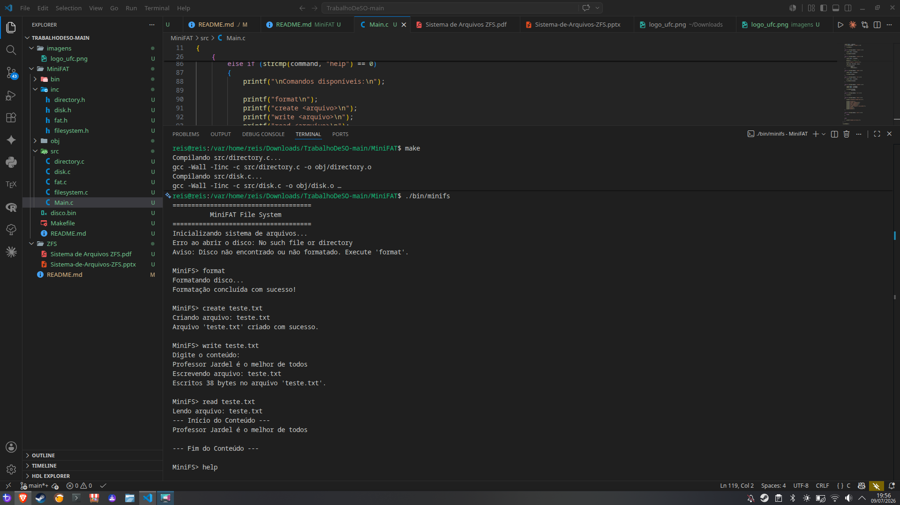

# MiniFAT - Sistema de Arquivos Simplificado

Este diretório contém a implementação em C do MiniFAT, um sistema de arquivos baseado em Tabela de Alocação (FAT) rodando em espaço de usuário e utilizando chamadas de sistema POSIX.

## Como Compilar e Executar

O projeto utiliza um `Makefile` para automatizar o processo. Abra o terminal nesta pasta e utilize os comandos abaixo:

* **`make`**: Compila todo o código-fonte.
  * *Nota: A execução deste comando gerará automaticamente duas novas pastas: `obj/` (que guarda os arquivos intermediários de compilação) e `bin/` (onde o executável final será salvo).*
* **`./bin/minifs`**: Inicia o shell interativo do sistema de arquivos.
* **`make clean`**: Limpa o projeto, apagando as pastas `obj/` e `bin/`, além de excluir o disco virtual (`disco.bin`), restaurando tudo ao estado de fábrica.

---

## Comandos (Help)

Ao iniciar a aplicação com `./bin/minifs`, aparecerá um terminal da aplicação (`MiniFS>`). Abaixo estão os comandos do sistema e seus parâmetros:

| Comando | Parâmetros | Descrição |
| :--- | :--- | :--- |
| `format` | *(nenhum)* | **Obrigatório no primeiro uso.** Instancia e formata o arquivo `disco.bin`, preparando a FAT e o Diretório. |
| `create` | `<arquivo>` | Cria um novo arquivo vazio no catálogo. |
| `write`  | `<arquivo>` | Prepara o arquivo para escrita. O sistema abrirá um prompt solicitando que você digite o conteúdo. |
| `read`   | `<arquivo>` | Lê e imprime o conteúdo do arquivo armazenado no disco virtual. |
| `ls`     | *(nenhum)* | Lista todos os arquivos existentes, exibindo seus nomes, tamanhos e bloco inicial. |
| `rename` | `<antigo> <novo>`| Altera o nome de um arquivo existente. |
| `rm`     | `<arquivo>` | Remove o arquivo do sistema e libera seus blocos de volta para a FAT. |
| `help`   | *(nenhum)* | Lista os comandos disponíveis diretamente no terminal. |
| `exit`   | *(nenhum)* | Salva o estado atual da memória para o disco e encerra a aplicação. |